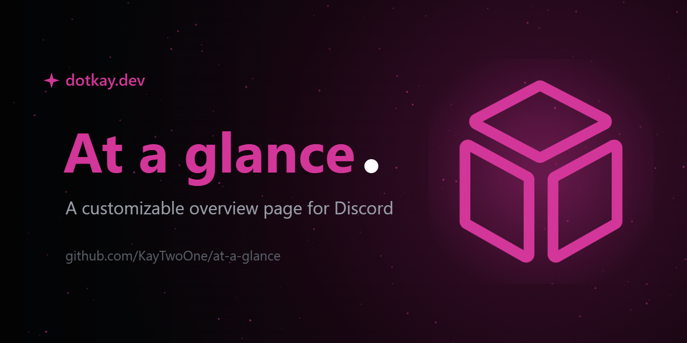

<div align="center">



**A customizable overview page for Discord, one tab above your Friends button.**

[](CHANGELOG.md)
[](https://vencord.dev)
[](#install)
[](LICENSE)

[Install](#install) · [Widgets](#widgets) · [Setup guide](SETUP.md) · [Orion add-on](#orion-add-on-optional) · [Changelog](CHANGELOG.md)

</div>

---

Pinned friends, watched channels, your inbox, quick tools and integrations, all on
one page that stays inside Discord's own UI. The server rail keeps working, the
titlebar is untouched, and everything is built on Discord's real internals: native
message rendering, native pickers, native send pipeline.

## Highlights

- **Quick chat popups.** Open any DM or channel in a centred popup with full chat
  functionality: replies, reactions, inline editing, GIF/emoji/sticker pickers,
  `:emoji` and `@mention`/`@role` autocomplete, a formatting toolbar, native-style
  message grouping and a "new messages" bar when you're scrolled up.
- **Everything is arrangeable.** Widgets drag between slots, friends drag into your
  own order, server sections drag and collapse. All of it persists per account.
- **Theme-proof.** Surfaces and inks adapt to light and dark themes automatically,
  Nitro gradients included, and your own primary/accent choices layer on top.
- **Your nameplate, everywhere.** The bottom-left user area wraps your Nitro
  nameplate around the whole strip, fading up into the sidebar.
- **Honest security posture.** One webpack patch, one external host (Open-Meteo for
  weather), validated storage, no eval, no token access. Details in
  [SECURITY.md](SECURITY.md).

## Widgets

| Widget | What it does |
| --- | --- |
| **Pinned Friends** | Presence, live activity, DM mention badges. Click for quick chat; right-click for profile, call, notes, nicknames, block and more. Two per row, drag to reorder. |
| **Inbox** | Two tabs: **Mentions** (Discord's recent-mentions inbox) and **Direct Messages** (every unread DM with avatar, preview and badge). Mark all read per tab. |
| **Quick Access Channels** | Watched channels grouped per server with collapsible headers that carry their own mention badge / unread dot. Voice rows show live occupants; double-click joins. |
| **Quick chat popup** | The centred chat card described above. Per-channel scroll memory, unread NEW divider, viewing acks the channel like a real view. |
| **Quick Tools** | Clock with extra timezones, stopwatch, countdown, calculator, and a `<t:…>` timestamp builder with live preview. |
| **Integrations & Notes** | Open-Meteo weather, Spotify now-playing (read-only, local), and structured notes with bullets, clickable todos and dividers. |
| **Events** | Upcoming scheduled events rolled up per server, with RSVP and one-click join when live. |
| **Saved Messages** | Bookmark any message; click jumps straight to it, highlighted, in its channel. |
| **Client Performance** | Renderer JS-heap and UI latency. Only metrics the renderer can honestly measure. |
| **Orion** _(optional, off by default)_ | Remote control for the separate OrionQuests plugin: status pill, Start / Stop / Status buttons, live per-quest progress. Enable it under **Add Widget**; inert unless OrionQuests is also installed. |

There's also a command palette (default `Shift+Space`), a quick-pin hotkey
(default `Ctrl+Shift+P`), a greeting header that counts your mentions, unread DMs
and channels, and an optional open-on-startup mode.

## Orion add-on (optional)

At a glance ships an optional **Orion** widget: a remote control for a **separate**
plugin called **OrionQuests**, which auto-completes Discord Quests. The widget is
**hidden by default** and does nothing on its own - it only comes alive if you choose
to install OrionQuests as well, wired up through a small versioned bridge so At a glance
never depends on it.

> [!WARNING]
> **OrionQuests automates your own Discord account.** Automating your account is against
> Discord's Terms of Service, and Discord actively enforces against quest automation:
> using it **can get your account limited or banned**. It is a separate, opt-in plugin -
> **not bundled with At a glance and off by default** - and installing it is entirely
> your own decision and risk. If in doubt, leave it out; everything else works without it.

Setup is in the [setup guide](SETUP.md#part-2-optional-add-the-orion-quest-widget), which
leads with the same warning. Once OrionQuests is installed and enabled, tick **Orion**
under **Add Widget** to get a status pill and Start / Stop / Status controls.

## Install

At a glance is a **userplugin**, compiled into Vencord from source:

```console
git clone https://github.com/Vendicated/Vencord
cd Vencord
pnpm install --frozen-lockfile
git clone https://github.com/KayTwoOne/at-a-glance src/userplugins/atAGlance
pnpm build && pnpm inject
```

Quit Discord fully before `pnpm inject` (tray icon, then Quit). Afterwards enable
**AtAGlance** under Settings → Vencord → Plugins and restart Discord once more.

**Already running Vencord from source with your own plugins?** Just the
`git clone … src/userplugins/atAGlance` line and a rebuild. The full walkthrough,
including multi-plugin setups, updating and troubleshooting, is in
**[SETUP.md](SETUP.md)**.

Dev loop: edit, `pnpm build` (or `pnpm dev` for watch), `Ctrl+R` in Discord.

## Architecture

One webpack patch inserts the sidebar tab (the same anchor Vencord's own PinDMs
uses); everything else goes through stable Vencord APIs. Config is validated and
capped on every load (IDs, notes text, weather location, layout state only) and
stored per account in IndexedDB. Message sending, blocking, calls, notes and RSVP
all invoke the same action creators Discord's own UI uses. Every widget sits in an
error boundary, so one broken internal never takes the page down.

Known limitations live at the bottom of [SETUP.md](SETUP.md#troubleshooting); the
short version is that the popup renders messages outside Discord's full list
context, so it ships its own reply/edit affordances, and a Discord restructure can
temporarily degrade the composer to a minimal fallback.

## License

[GPL-3.0](LICENSE), same as Vencord.
